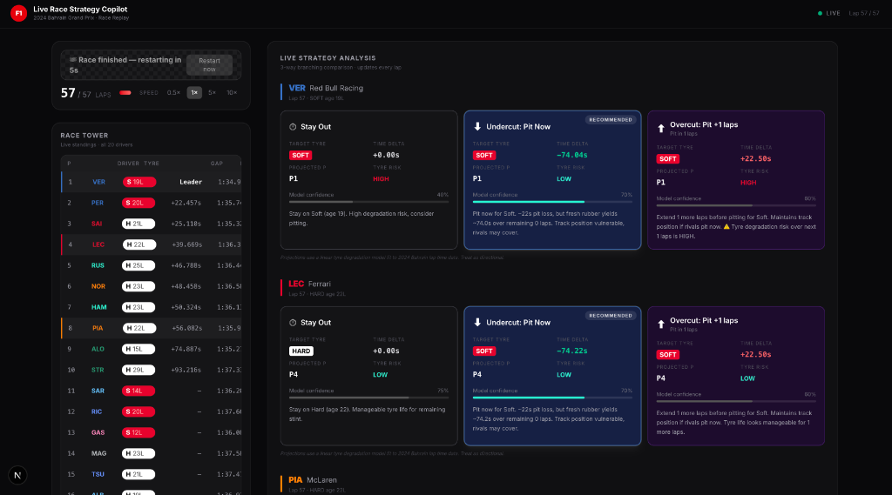
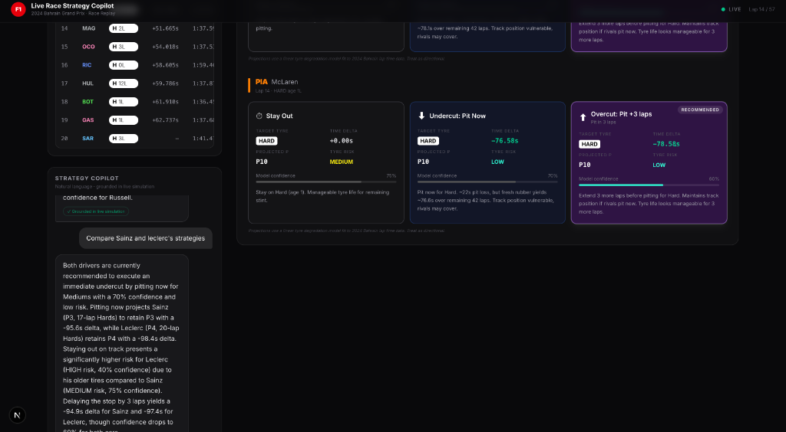
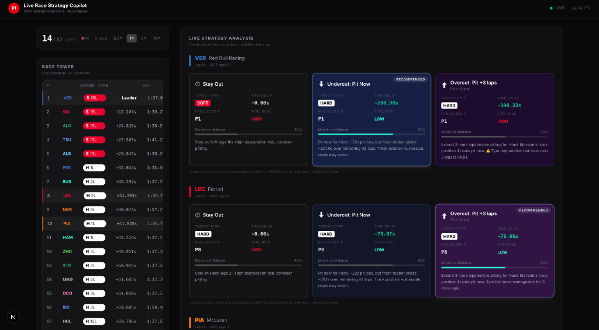

# F1 Live Race Strategy Copilot

> A real-time Formula 1 race strategy simulation tool with a natural-language AI agent, built on live 2024 Bahrain GP telemetry. Not a toy demo, a full event-driven data pipeline with a grounded LLM layer on top.

[](https://vercel.com)
[](https://render.com)
[](https://neon.tech)

---

## Screenshots

| Race Tower + Strategy Cards | Strategy Copilot Agent | Early Race View |
|---|---|---|
|  |  |  |

## Demo

[Watch the 50-second demo on Google Drive](https://drive.google.com/file/d/1QurynIqBrOd7h9H2bsjR8NNSVaYmFRWd/view?usp=sharing)

---

## What it does

### Part 1: Live Strategy Engine

Replays real **2024 Bahrain GP telemetry** (lap times, tyre stints, pit stops, inter-car gaps) at accelerated speed via an event-driven pipeline, and **continuously computes a 3-way branching strategy comparison** per focus driver, updating every lap as the replay advances.

| Option | What it computes |
|--------|-----------------|
| **Stay Out** | Projects degradation cost of extending the current stint to race end |
| **Undercut** | Simulates pitting this lap: pit lane time loss vs fresh-tyre pace gain vs position jump if rivals stay out |
| **Overcut** | Stays out *N* more laps before pitting: track position retained vs pace lost on worn rubber |

Each card shows: projected finish position, time delta vs stay-out (± seconds), tyre life risk (LOW / MEDIUM / HIGH), confidence score, and one-sentence reasoning. The recommended option is highlighted. Everything updates live.

### Part 2: Natural Language Agent

A **LangGraph agent** answers questions like *"what if Perez had pitted a lap earlier?"* by **actually re-running the underlying strategy simulation** with the modified parameters, not a canned LLM response. Powered by **Gemini 3.6 Flash** with a graceful quota fallback that returns raw simulation data if the free daily limit is hit.

---

## Architecture

```
┌─────────────────────────────────────────────────────────────────────┐
│  Neon Postgres (free-forever)                                       │
│  Pre-fetched 2024 Bahrain Race:                                     │
│  raw_laps · raw_stints · raw_pits · raw_intervals · raw_positions   │
└────────────────────────────┬────────────────────────────────────────┘
                             │  reads rows in lap order
                             ▼
┌─────────────────────────────────────────────────────────────────────┐
│  Render: single web service, one /health wake-up ping               │
│                                                                     │
│  FastAPI + asyncio background tasks:                                │
│  ├── ReplayProducer   reads Postgres → pg_notify(lap_event)         │
│  ├── StrategyConsumer asyncpg LISTEN → strategy_engine → RACE_STATE │
│  └── WSBroadcaster    reads RACE_STATE every 2s → WebSocket push    │
│                                                                     │
│  RACE_STATE = plain Python dict (replaces Redis, zero external I/O) │
│                                                                     │
│  HTTP:  GET /health  ·  GET /ws  ·  POST /agent                     │
└─────────────────────────────────────────────┬───────────────────────┘
                                              │ WebSocket push every 2s
                                              ▼
                               ┌────────────────────────────────────┐
                               │  Vercel: Next.js 15                │
                               │                                    │
                               │  ├── Race Tower (live standings)   │
                               │  ├── Strategy Cards (3-way live)   │
                               │  ├── Agent Chat (NL queries)       │
                               │  └── /api/agent  proxy             │
                               └────────────────────────────────────┘

On mount: silent fetch('/health', {mode:'no-cors'})
wakes Render before visitor notices the cold-start delay.
```

### Event pipeline detail

```
Neon Postgres
  └─ ReplayProducer: SELECT laps ORDER BY lap_number
       └─ pg_notify('telemetry_replay', lap_json)   ← Postgres built-in, no Kafka needed
            └─ StrategyConsumer: asyncpg LISTEN
                 └─ strategy_engine(DriverState) → StrategyResult
                      └─ RACE_STATE["strategies"][dn]  ← in-memory dict, no Redis needed
                           └─ WSBroadcaster: push frame every 2s to all WebSocket clients
```

### Natural language agent path

```
User question
  → POST /api/agent  (Vercel: thin proxy, no LangGraph in serverless)
  → POST /agent      (Render: stateful LangGraph process)
      ├── read_race_state   reads RACE_STATE dict directly (in-process, zero latency)
      ├── parse_intent      Gemini: what-if | explain | compare + entity extraction
      ├── run_simulation    re-calls strategy_engine() with modified params
      └── compose_answer    Gemini: grounded answer referencing sim numbers
  → { answer, sim_table, grounded: true, quota_fallback: bool }
```

---

## Strategy model

The engine uses a **first-order linear tyre degradation model** fit from 2024 Bahrain lap time distributions:

| Compound | Pace Delta vs Hard | Degradation rate |
|----------|--------------------|-----------------|
| SOFT     | -1.2 s/lap         | 0.085 s/lap/lap |
| MEDIUM   | -0.5 s/lap         | 0.040 s/lap/lap |
| HARD     | baseline           | 0.018 s/lap/lap |

The model is labelled explicitly in the UI: *directional accuracy over overclaiming*. Position simulation for undercuts models which cars within 1.5x pit-delta gap can be jumped based on relative tyre age.

---

## Local setup

### Prerequisites
- Python 3.12+ · Node 18+ · [uv](https://astral.sh/uv)
- Accounts: [Neon](https://neon.tech) · [Google AI Studio](https://aistudio.google.com)

### Backend
```bash
cd backend

# Create venv + install dependencies
uv venv --python 3.12
source .venv/bin/activate
uv pip install -r requirements.txt

# Configure credentials (only two services needed)
cp .env.example .env
# Fill in DATABASE_URL, DATABASE_URL_SYNC (from Neon dashboard)
# Fill in GOOGLE_API_KEY (from Google AI Studio)

# Seed the database (one-shot, ~2 min)
# Downloads 2024 Bahrain race data from OpenF1 → Neon Postgres
python scripts/fetch_race_data.py
# Prints completeness report + recommended SESSION_KEY and FOCUS_DRIVERS values
# Copy those values into .env

# Run
uvicorn main:app --reload
# Visit http://localhost:8000/health — should return {"status":"ok",...}
```

### Frontend
```bash
cd frontend
cp .env.local.example .env.local
# Set NEXT_PUBLIC_WS_URL=ws://localhost:8000/ws
# Set NEXT_PUBLIC_BACKEND_URL=http://localhost:8000

npm install
npm run dev
```

---

## Deployment

### 1 · Neon: seed data
Run `python scripts/fetch_race_data.py` with your production `DATABASE_URL_SYNC`.
Update `SESSION_KEY` and `FOCUS_DRIVERS` in Render's env vars to match the output.

### 2 · Render: backend
- Connect this repo → Render detects `render.yaml` automatically
- Set `DATABASE_URL`, `DATABASE_URL_SYNC`, and `GOOGLE_API_KEY` in the Render dashboard
- Update `SESSION_KEY` and `FOCUS_DRIVERS` to the values printed by the seeder script
- No secret files needed (no Kafka CA cert required)

### 3 · Vercel: frontend
- Connect this repo → set **Root Directory** to `frontend/`
- Add `NEXT_PUBLIC_WS_URL` and `NEXT_PUBLIC_BACKEND_URL` in Vercel dashboard

### Cold-start smoke test
1. Leave everything idle for **1+ hour** (Render sleeps after 15 min of inactivity)
2. Open the app in a fresh browser tab
3. **Expected:** "Connecting to race engine..." overlay disappears within ~60s
4. Race tower populates; strategy cards start updating every lap
5. Ask a question in the agent chat
6. **Expected:** answer cites specific lap numbers and time deltas from the simulation

---

## Accounts (all free-forever, no card required)

| Service | Sign-up | Purpose |
|---------|---------|---------|
| [Neon](https://neon.tech) | GitHub OAuth | Postgres: stores pre-fetched race telemetry and serves LISTEN/NOTIFY |
| [Render](https://render.com) | GitHub OAuth | Python backend web service |
| [Google AI Studio](https://aistudio.google.com) | Google account | Gemini 3.6 Flash API key |
| [Vercel](https://vercel.com) | GitHub OAuth | Next.js frontend hosting |

> **No Kafka. No Redis.** The message bus is Postgres `LISTEN/NOTIFY` (built into Neon, no extra service). The state cache is a plain Python dict (in-process, zero network hops). Two fewer services to sign up for, two fewer things that can go wrong.

---

## Tech stack

| Layer | Technologies |
|-------|-------------|
| **Backend** | Python 3.12 · FastAPI · asyncio · asyncpg (LISTEN/NOTIFY) · SQLAlchemy |
| **AI / Agent** | LangGraph · Gemini 3.6 Flash (`google-generativeai`) |
| **Frontend** | Next.js 15 · TypeScript · Tailwind CSS v4 · Inter |
| **Infrastructure** | Vercel · Render · Neon Postgres |
| **Data** | [OpenF1 API](https://openf1.org): 2024 Bahrain GP, pre-fetched at build time |

---

## Repository structure

```
f1-strategy-copilot/
├── backend/
│   ├── main.py                   # Single FastAPI app: ReplayProducer, StrategyConsumer, WSBroadcaster
│   ├── strategy_engine.py        # Pure function: race state → 3 strategy options
│   ├── agent.py                  # LangGraph graph + Gemini 3.6 Flash integration
│   ├── scripts/
│   │   └── fetch_race_data.py    # One-shot OpenF1 → Neon seeder + focus trio picker
│   ├── db/
│   │   └── models.py             # SQLAlchemy ORM models
│   └── requirements.txt
├── frontend/
│   ├── app/
│   │   ├── page.tsx              # Main dashboard
│   │   └── api/agent/route.ts   # Proxy to Render /agent (keeps LangGraph off serverless)
│   ├── components/
│   │   ├── RaceTower.tsx         # Live standings tower
│   │   ├── StrategyCards.tsx     # 3-way branching strategy panel
│   │   ├── AgentChat.tsx         # NL chat with grounded/quota badges
│   │   ├── LapProgress.tsx       # Race progress + speed control (0.5x-10x)
│   │   └── ConnectionOverlay.tsx # Cold-start wake-up UX
│   └── hooks/
│       └── useRaceSocket.ts      # WS hook + silent wake-up ping
├── render.yaml                   # Single Render web service config
└── README.md
```
